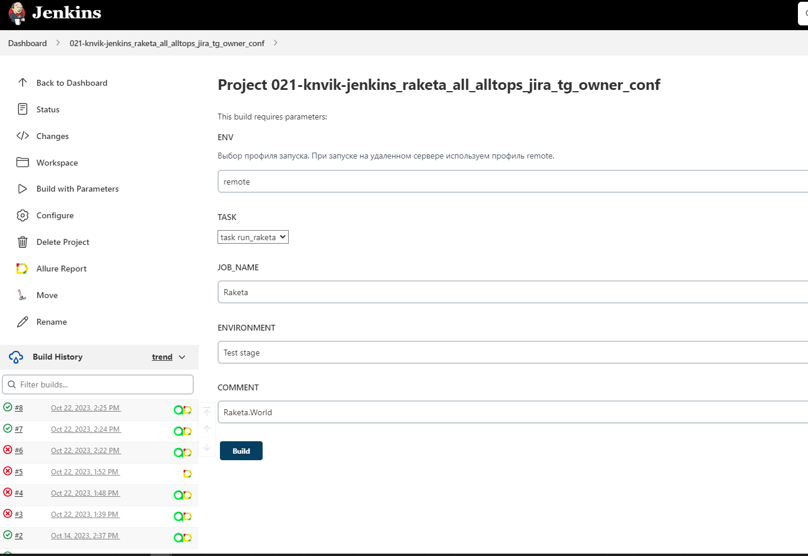
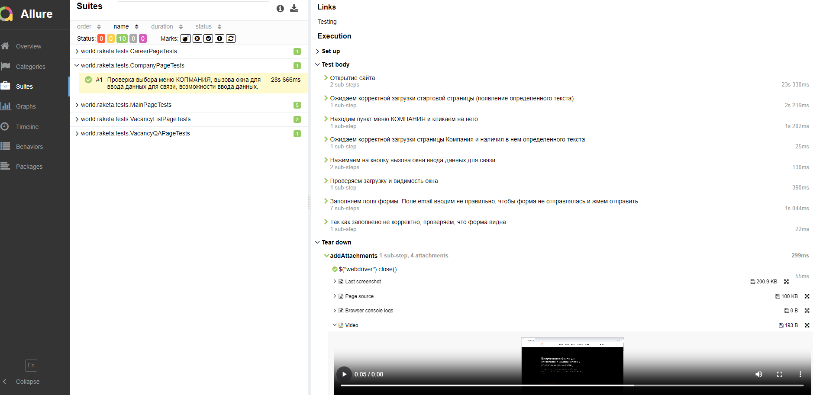
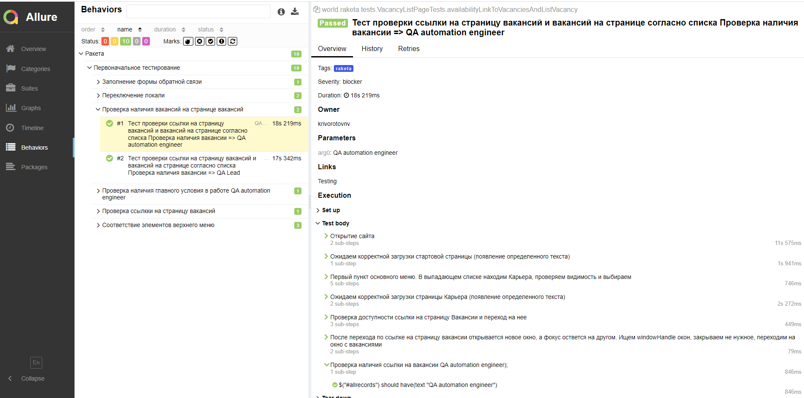
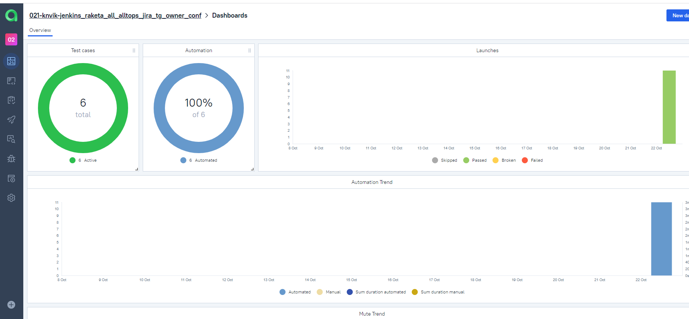
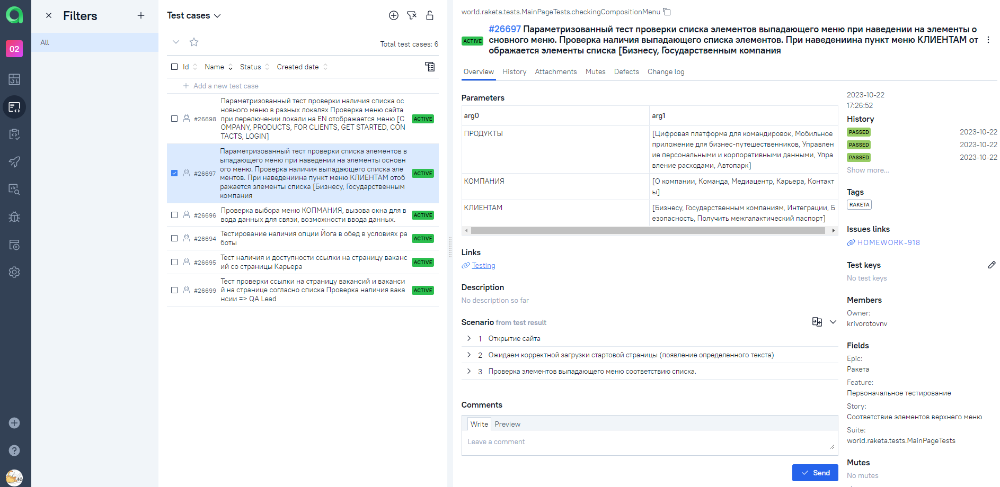
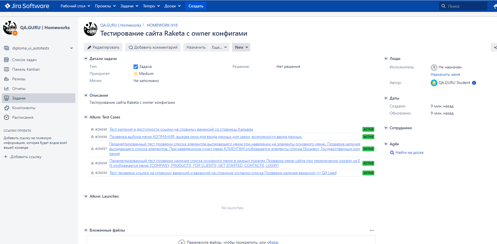
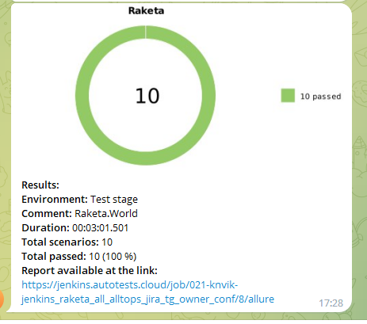
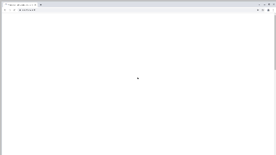

<h1> Проект по автоматизации тестовых сценариев для сайта цифровой платформы для организации командировок и управления расходами  </h1>

* ### https://raketa.world/ – тестируемый ресурс.

## :pushpin: Содержание:

- [Использованный стек технологий](#computer-использованный-стек-технологий)
- [Запуск тестов из терминала](#arrow_forward-запуск-автотестов)
- [Сборка в Jenkins](#-сборка-в-jenkins)
- [Пример Allure-отчета](#-пример-allure-отчета)
- [Интеграция с Allure TestOps](#-интеграция-с-allure-testOps)
- [Интеграция с Jira](#-интеграция-с-jira)
- [Уведомления в Telegram с использованием бота](#-уведомления-в-telegram-с-использованием-бота)
- [Видео примера запуска тестов в Selenoid](#-видео-примера-запуска-тестов-в-selenoid)
  
## :computer: Использованный стек технологий


<p align="center">


</p>

- В данном проекте автотесты написаны на языке `Java` с использованием фреймворка для тестирования `Selenide`.
- В качестве сборщика был использован - `Gradle`.
- Использованы фреймворки `JUnit 5` и [Selenide](https://selenide.org/).
- При прогоне тестов браузер запускается в [Selenoid](https://aerokube.com/selenoid/).
- Для удаленного запуска реализована джоба в `Jenkins` с формированием Allure-отчета и отправкой результатов в `Telegram` при помощи бота.


Содержание Allure-отчета:
* Шаги теста;
* Скриншот страницы на последнем шаге;
* Page Source;
* Логи браузерной консоли;
* Видео выполнения автотеста.

## :arrow_forward: Запуск автотестов

### Запуск тестов из терминала
```
gradle clean run_raketa 
```
В проекте применяется библиотека owner с опцией считывания параметров из файлов конфигурации, помещенных в папку resources. Имеются три предустановленные конфигурации 

* <code>local</code> – запуск тестов на локальной машине с браузером.
* <code>remote</code> – запуск тестов с использованиес удаленного Selenoid.
* <code>localSelenoid</code> –  запуск тестов с использованием локального Selenoid запущенного в Docker.

По умолчанию выбирается профиль local. Для выбора другого профиля следует указать его в строке запуска, например:


```
gradle clean run_raketa  -Denv=remote
```

При выполнении команды, данные тесты запустятся удаленно в предопределенном <code>Selenoid</code>.


##  <a href="https://jenkins.autotests.cloud/job/021-knvik-jenkins_raketa_all_alltops_jira_tg_owner_conf/" target="_blank" rel="noopener"><span>Сборка в Jenkins</span> </a>

Для запуска сборки необходимо перейти в раздел Собрать с параметрами и нажать кнопку Собрать.

####   Доступные для изменения параметры :
* <code>TASK</code> – выбор задачи.


Запускается профиль remote. Остальные параметры считываются из файла конфигурации

<kbd>[](https://jenkins.autotests.cloud/job/021-knvik-jenkins_raketa_all_alltops_jira_tg_owner_conf/)</kbd>

##  Пример Allure-отчета
##### <a href="https://jenkins.autotests.cloud/job/021-knvik-jenkins_raketa_all_alltops_jira_tg_owner_conf/8/allure/#" target="_blank" rel="noopener"><span>Overview</span> </a>


<kbd>[](https://jenkins.autotests.cloud/job/021-knvik-jenkins_raketa_all_alltops_jira_tg_owner_conf/8/allure/)</kbd>

#####  <a href="https://jenkins.autotests.cloud/job/021-knvik-jenkins_raketa_all_alltops_jira_tg_owner_conf/8/allure/#suites/99d55f6db0c04008985fd906f3e2dc5e/ce8113689735c9e3/" target="_blank" rel="noopener"><span>Результат выполнения теста</span> </a>

<kbd>[](https://jenkins.autotests.cloud/job/021-knvik-jenkins_raketa_all_alltops_jira_tg_owner_conf/8/allure/#suites/99d55f6db0c04008985fd906f3e2dc5e/ce8113689735c9e3/
)</kbd>

#### <a href="https://jenkins.autotests.cloud/job/021-knvik-jenkins_raketa_all_alltops_jira_tg_owner_conf/8/allure/#behaviors/aa35b6349be711bd68148bf5dae0d52a/c3f695d8d094a2ff/" target="_blank" rel="noopener"><span>Behaviors</span> </a>

<kbd>[](https://jenkins.autotests.cloud/job/021-knvik-jenkins_raketa_all_alltops_jira_tg_owner_conf/8/allure/#behaviors/aa35b6349be711bd68148bf5dae0d52a/c3f695d8d094a2ff/
)</kbd>

##  Интеграция с Allure TestOps

Выполнена интеграция сборки <code>Jenkins</code> с <code>Allure TestOps</code>.
Результат выполнения автотестов отображается в <code>Allure TestOps</code>
На Dashboard в <code>Allure TestOps</code> отображена статистика пройденных тестов.

##### <a href="https://allure.autotests.cloud/project/3728/dashboard" target="_blank" rel="noopener"><span>Dashboards</span> </a>

<kbd>[](https://allure.autotests.cloud/project/3728/dashboard)</kbd>

##### <a href="https://allure.autotests.cloud/project/3728/test-cases/26697?treeId=0" target="_blank" rel="noopener"><span>Test cases</span> </a>

<kbd>[](https://allure.autotests.cloud/project/3728/test-cases/26697?treeId=0)</kbd>

##  Интеграция с Jira

Реализована интеграция <code>Allure TestOps</code> с <code>Jira</code>, в тикете отображается информация, какие тест-кейсы были написаны в рамках задачи и результат их прогона.

##### <a href="https://jira.autotests.cloud/browse/HOMEWORK-918" target="_blank" rel="noopener"><span>Jira</span> </a>

<kbd>[](https://jira.autotests.cloud/browse/HOMEWORK-918)</kbd>


##  Уведомления в Telegram с использованием бота

После завершения сборки, бот созданный в <code>Telegram</code>, автоматически обрабатывает и отправляет сообщение с результатом.

<p align="center">

</p>

## Видео примера запуска тестов в Selenoid

К каждому тесту в отчете прилагается видео прогона.
<p align="center">
  
</p>